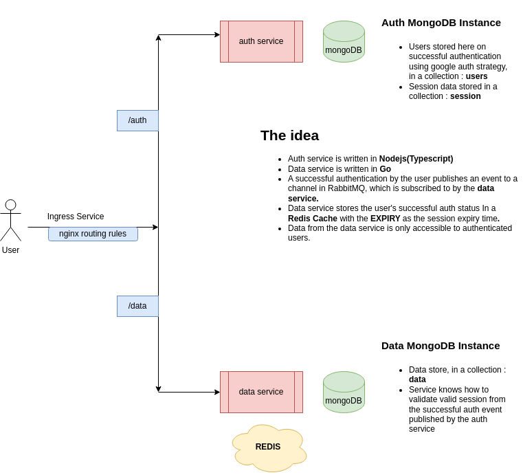

# Go-Ts

- Pub / Sub pattern using RabbitMQ between two microservices.

## Overview

### Commands

- Generate protobuf boiler plate code using the command (protobuf compiler (protoc) has to be installed globally):

> protoc --go_out=. --go_opt=paths=source_relative --go-grpc_out=. --go-grpc_opt=paths=source_relative auth.proto
